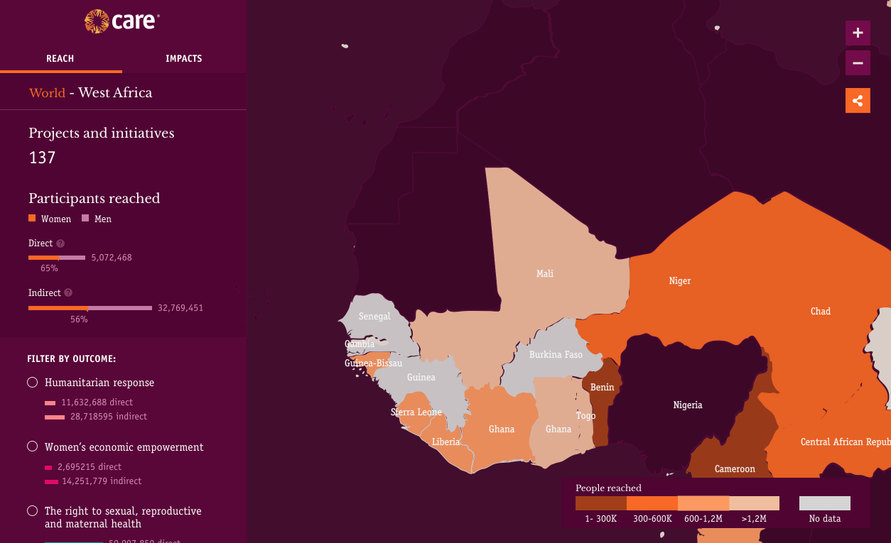

# CARE International



## Installation

Requirements:

* [NodeJs](https://nodejs.org/es/download/)

To install run command:

```bash
yarn install
```

## Usage

In development mode, we can start a local server running:

```bash
BASE_LAYER_ID=aa0b663e-b8af-4433-9ab0-4dbeb7c1b981 LABEL_LAYER_ID=3cb14d6b-49ab-423b-8290-7a19d374381e CARTODB_ACCOUNT=careinternational yarn run start

```

## Contributing

1. Fork it!
2. Create your feature branch: `git checkout -b feature/my-new-feature`
3. Commit your changes: `git commit -am 'Add some feature'`
4. Push to the branch: `git push origin feature/my-new-feature`
5. Submit a pull request :D

## LICENSE

[MIT](LICENSE)
